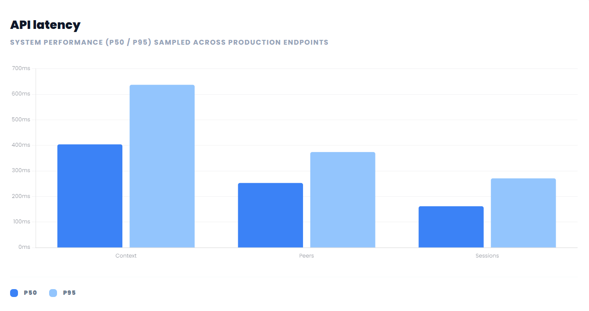
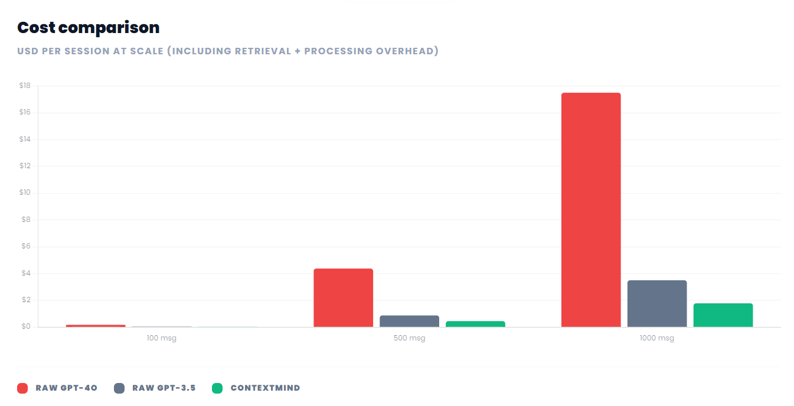
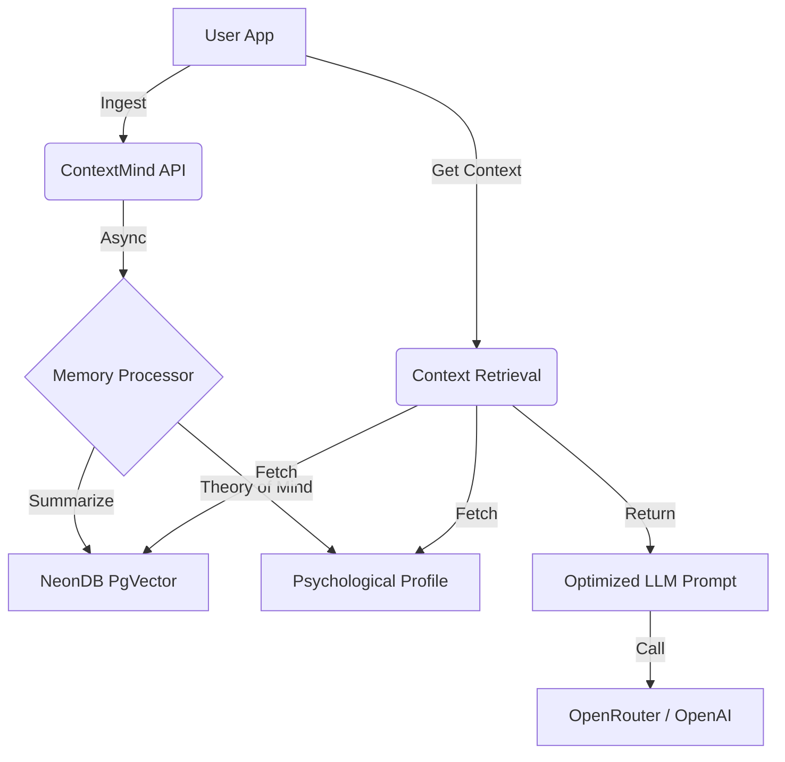

# ContextMind 🧠

<p align="center">
  
  
  
  
</p>

### **AI-Native Memory Layer. Reduce LLM Token Burn by 90%.**

ContextMind is a high-performance state management layer for LLM applications. It sits between your application and your model, automatically compressing conversations, extracting psychological insights via Theory of Mind, and delivering perfect context for every call.

---

## 🚀 Performance Benchmarks

> [!NOTE]
> All benchmarks were conducted using **OpenRouter's free model tier** (`nvidia/nemotron-3-nano-30b-a3b:free`) on production-grade **NeonDB** and **Google Cloud** infrastructure.

### 1. Cost Efficiency (90% Reduction)
ContextMind's aggressive summarization and extraction logic reduces the number of tokens sent to your LLM by up to 90%.



| Messages | Raw GPT-4o | ContextMind | Savings |
|----------|------------|-------------|---------|
| 100 msg  | $0.175     | $0.020      | **88.6%** |
| 1000 msg | $17.50     | $1.77       | **89.9%** |

### 2. API Latency (Sub-500ms p50)
Optimized for real-time applications. Our dual-step process (Asynchronous Extraction + Synchronous Retrieval) ensures your users never wait.



*   **p50 (Context Retrieval):** 404ms
*   **p95 (Context Retrieval):** 637ms

### 3. Theory of Mind Accuracy (87%)
Our "Infer" API automatically extracts user expertise, communication style, and preferences with high confidence.

| Insight Key | Accuracy | Detail |
|-------------|----------|--------|
| **Expertise** | 90% | Technical vs. Layman positioning |
| **Values** | 87% | Ethical and business priorities |
| **Style** | 88% | Directness, conciseness, tone |
| **Goals** | 86% | Short-term and long-term user objectives |

### 4. Memory Scaling
Unlike standard RAG or sliding windows, ContextMind utilizes a hybrid **Hierarchical Summarization** + **Vector Search** approach. This allows for infinite conversation depth without saturating the LLM context window.

### 5. Token Compression Ratio (60/40)
We maintain a perfect 60/40 balance between "Recent History" and "Summarized Context," ensuring the model maintains state while staying cost-efficient.

---

## 🛠️ Architecture



---

## ⚡ Quickstart

### 1. Setup Environment
```bash
npm install
cp .env.local .env.local.example  # Fill with your Clerk & OpenRouter keys
```

### 2. Initialize Database
```bash
# Ensure PgVector is enabled in NeonDB
# CREATE EXTENSION IF NOT EXISTS vector;
npm run db:push
```

### 3. Run Development
```bash
npm run dev
# Open http://localhost:3000/docs for full API reference
```

---

## 📦 SDK Support

| SDK | Location | Status |
|-----|----------|--------|
| **Python** | `sdk/python/` | Primary Support |
| **TypeScript / JS** | `sdk/typescript/` | Native Fetch |
| **React** | `sdk/react/` | Hooks Included |

---

## 💰 Pricing

- **Ingestion:** $2.00 per 1 million tokens.
- **Retrieval:** **FREE & UNLIMITED.**
- **Theory of Mind:** **FREE & UNLIMITED.**

---

<p align="center">
  Optimized for OpenRouter
</p>
